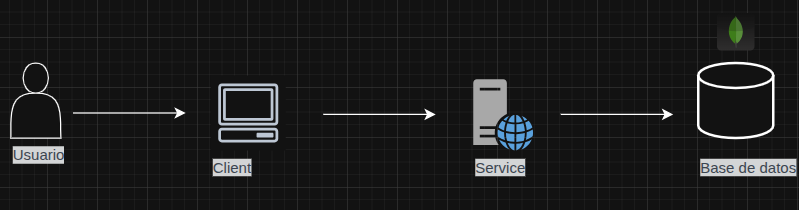

**DOCUMENTACIÓN**

📌 **1️⃣ Nombre del Proyecto**

Comunidad DDG

🚀 **Descripción del Proyecto**

¿Qué hace nuestra aplicación?
Esta aplicación web tiene como objetivo facilitar la transmisión de
información en tiempo real entre los usuarios de una comunidad
pequeña. Los usuarios podrán compartir publicaciones que incluyan
texto e imágenes sobre los eventos o sucesos que están ocurriendo en
su entorno.
La funcionalidad de la aplicación es similar a la de plataformas como X
(anteriormente conocida como Twitter), pero enfocada en la difusión de
información dentro de una comunidad específica.
La aplicación contará con una pantalla donde se mostrarán todas las
publicaciones generadas por los usuarios y también los anuncios.
Además, los usuarios podrán interactuar con los anuncios publicados,
según su rol: administrador o usuario común. Los administradores
tendrán la capacidad de gestionar y moderar las publicaciones, mientras
que los usuarios normales podrán realizar publicaciones dentro de la
plataforma. Y el último rol será el de vigilante, quien será encargado de
gestionar el acceso de los visitantes, pidiéndoles datos generales, como
por ejemplo: nombre, número de casa a visitar, número de placa, etc. y
será el encargado de administrar horarios en el transcurso de la semana
a los vigilantes que estén bajo el control de él.

**¿Para quién está dirigida?**

El objetivo fué darle una facilidad a los usuarios o a las personas que
viven dentro de una comunidad pequeña, el hecho de estar más
informadas de lo que pasa, que puedan compartir información para
informar a otras personas, y sobre todo el hecho de que se incluyan
más en la formación de una comunidad, ya que hoy en día en colonias o
en pequeños pueblos, siempre existe la formación de grupos en físico,
pero a medida que la tecnología ha avanzado las personas cada vez
más se han sumergido en el mundo de la tecnología.

**¿Qué problema resuelve?**

Ayudar a las personas que tienen problemas para estar informadas, y poder 
brindarles una opción en crecimiento para poder informarse con facilidad, 
que son las tecnologías, y también el hecho de tener una interfaz fácil de 
manejar y bastante intuitiva.

📦 **Requisitos Previos**

Node.js >= v22.20.0

NPM >= 10.9.3

Git

Cuenta en: https://www.mongodb.com/ y un cluster creado.

⚙️ **Instalación**

Paso 1: Abrir terminal en la ruta que le resulte conveniente y ejecute la siguiente instrucción: git clone https://github.com/golic98/ProyectoIS2025

Paso 2: Abrir la carpeta y encontrará 2 sub-carpetas: client y service, abrir 2 terminales y colocar: cd cliente (en la primera terminal) y luego cd service (en la otra terminal), y en ellas debe hacer: npm install, para que se instalen todas las dependencias.

▶️ **Ejecución de la Aplicación**

En la terminal que utilizó para la sub-carpeta client hacer: npm run dev.
En la terminal que utilizó para la sub-carpeta service hacer: npm run dev.

🔐 **Variables de Entorno**

En la sub-carpeta llamada service, debe colocar en la ubicación raíz un archivo: .env.
Y debe colocar lo siguiente, donde usuario y password son las credenciales del cluster que creó:

MONGO_URL=mongodb+srv://<usuario>:<password>@cluster.mongodb.net/?retryWrites=true&w=majority

PORT=3000

JWT_SECRET=changeme

📘 2️⃣ **Documentación de Arquitectura**

📌 **Diagrama de Arquitectura del Sistema**

🏗️ 2️⃣ **Decisiones Arquitectónicas**

**React.js** ➝ permite una interfaz dinámica, rápida y modular para mejorar la experiencia del usuario.

**Node.js + Express** ➝ facilita crear una API eficiente en JavaScript con buen rendimiento y escalabilidad.

**MongoDB Atlas** ➝ base NoSQL perfecta para manejar publicaciones y datos flexibles sin esquemas rígidos.

**JWT** ➝ seguridad basada en tokens para manejo de roles (admin, usuario, vigilante).

**Arquitectura cliente-servidor** ➝ separa responsabilidades y facilita el mantenimiento del proyecto.